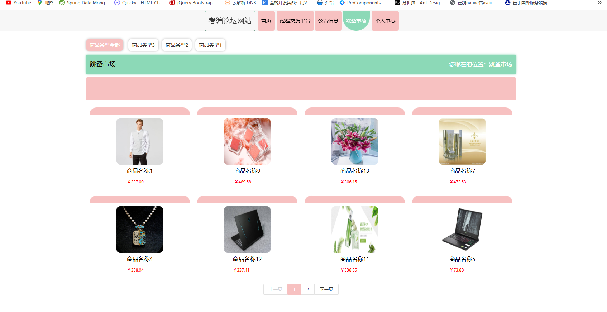

# 一、系统说明

基于springboot+vue+elementui开发的考编论坛网站,系统功能齐全, 代码简洁易懂，适合小白学编程。

# 二、系统架构

######      前端：vue| elementui

######      后端：springboot | mybatis 

######      环境：jdk1.8+ | mysql8.0+ | maven

# 三、代码及数据库

# 四、相关功能介绍

#### 1).客户端

###### 1.登录

###### 2.首页

###### 3.经验交流平台

###### 4.公告信息

###### 5.跳骚市场

###### 6.商品购买

###### 7.个人中心

###### 8.个人中心->收货地址管理

###### 9.个人中心->商品信息

包含:添加、修改、删除功能

###### 10.个人中心->商品订单

包括:退款功能

###### 2).管理端

###### 1.登录

2.用户注册

###### 3.个人中心->修改密码

###### 4.管理员信息

包含:详情、删除、修改、查看、新增功能

###### 5.经验交流平台

包含:详情、删帖、修改、新增功能

###### 6.公告信息管理

包含:详情、删除、查询、新增功能

###### 7.跳蚤市场管理

包含:新增、修改、删除、详情功能

###### 8.跳蚤市场管理->商品留言管理

包含:详情、删除、查询功能

###### 9.跳蚤市场管理->商品订单管理

###### 10.用户管理

包含:详情、删除、查询、修改、重置密码功能

###### 10.轮播图管理

